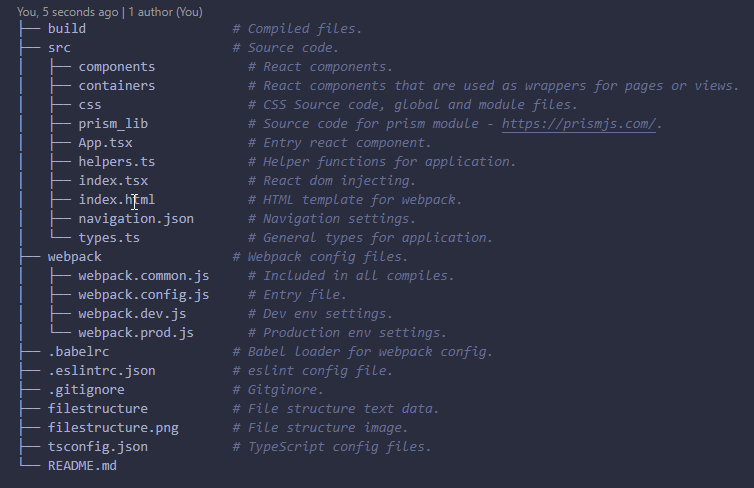

# MD Notes
Markdown notes with syntax highlighting.
Custom built text editor engine, displaying a code-editor styled view.

## Tech stack
- NodeJS
- TypeScript
- React / Styled components
- React Router
- express.js

## Develop
1. `npm i`
2. `npm run dev`
3. Open browser and navigate to `localhost:3000`

### File Structure

<!--
Webpack / TS / Babel set up inspired by https://www.youtube.com/watch?v=Elpu7CIuqjY&ab_channel=Codevolution
-->
